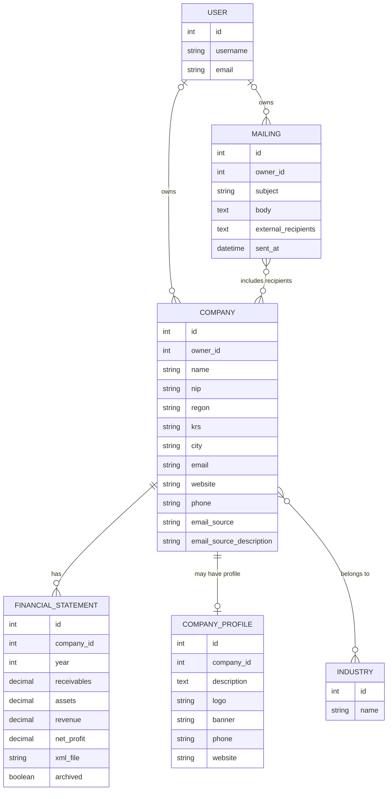

# Financial Statement Analysis System

## Django web application for company management and analysis of XML financial statements (PRS/KRS)

**English** | [Polski](README_PL.md)

---

## About the Project

The Financial Statement Analysis System is a web application developed in Python using the Django framework.

The project was created as a portfolio application and designed with practical use in company analysis and financial data management in mind.

Its main purpose is to enable users to manage a database of companies, import financial statements from XML files obtained from the Polish PRS/KRS system, and present key financial information in a structured and accessible form.

The project uses technologies commonly found in modern backend applications, including Django, Django REST Framework, PostgreSQL, JWT, Celery, Redis, Docker, pytest, and production deployment on Railway.

The application was designed as a foundation for long-term development. Future stages are planned to include more advanced financial analysis, financial ratios, company assessment modules, and solutions involving Data Science, DevOps, and Cybersecurity.

---

# Table of Contents

- [Why Was This Project Created?](#why-was-this-project-created)
- [Project Goals](#project-goals)
- [Key Features](#key-features)
- [Application Architecture](#application-architecture)
- [Data Model](#data-model)
- [XML Financial Statement Import](#xml-financial-statement-import)
- [Security and User Data Isolation](#security-and-user-data-isolation)
- [REST API](#rest-api)
- [Automated Tests](#automated-tests)
- [Deployment](#deployment)
- [Docker](#docker)
- [Celery and Asynchronous Tasks](#celery-and-asynchronous-tasks)
- [Responsive Design](#responsive-design)
- [Project Development History](#project-development-history)
- [Technologies](#technologies)
- [Project Structure](#project-structure)
- [Installation and Running the Project](#installation-and-running-the-project)
- [Django Admin Panel](#django-admin-panel)
- [Configuration and Environment Variables](#configuration-and-environment-variables)
- [Future Development](#future-development)
- [Author](#author)
- [License](#license)

---

# Why Was This Project Created?

Many portfolio projects focus primarily on presenting a finished product. The purpose of this project, however, was not only to build a web application, but also to gain practical experience with technologies used by modern Python developers.

The project evolved incrementally. New functionality was implemented as additional topics were covered during the Python Developer course. As a result, the application became not only a portfolio project, but also a practical environment for learning application design, implementation, testing, and deployment.

The subject of financial statement analysis was chosen deliberately. Rather than building another simple demonstration project, the goal was to create an application addressing a real business problem while providing a foundation for further development in financial data analysis, company assessment, Data Science, and artificial intelligence.

The project was designed for long-term development. Future stages will include expanding the analytical modules, further developing the REST API, introducing additional technologies, and extending functionality as new skills and experience are acquired.

---

# Project Goals

The primary goal of the project was to build a modern Django web application for managing companies and importing and analyzing financial statements stored in XML format.

The project was also intended to provide practical use of technologies learned during the Python Developer course. Instead of creating several small, independent applications, one larger project was developed from the beginning and gradually expanded with each new feature.

The main project goals include:

- building a multi-user web application,
- ensuring full isolation of user data,
- importing financial statements from XML files,
- using PostgreSQL as the relational database,
- providing a REST API with Django REST Framework,
- implementing JWT authentication,
- deploying the application on Railway,
- creating automated tests with pytest,
- building a project suitable for a professional Python Developer portfolio.

> **Why this approach?**
>
> The goal was not only to complete the course, but to build a project that would continue to evolve afterwards and serve as a foundation for further learning and for presenting practical skills during job interviews.

---

# Key Features

The application currently provides the following functionality:

## User Management

- user registration,
- login and logout,
- full data isolation between users,
- access protection using Django's built-in security mechanisms.

## Company Management

- adding, editing, and deleting companies,
- assigning companies to the account owner,
- assigning industries to companies,
- maintaining a company profile containing additional information.

## Financial Statements

- importing financial statements from XML files,
- automatic extraction of data from documents,
- storing multiple financial statements for a single company,
- archiving and restoring financial statements.

## Communication

- preparing mailings,
- viewing the history of sent messages,
- managing correspondence from within the application.

## REST API

- exposing application data through Django REST Framework,
- authentication using JWT,
- API documentation with Swagger UI and ReDoc.

## Project Quality

- automated tests prepared with pytest,
- PostgreSQL relational database,
- asynchronous task processing with Celery and Redis,
- containerization with Docker,
- production deployment on Railway.

> **Why is this section important?**
>
> It presents not only the technologies used, but above all the capabilities of the application. This allows a reader to quickly understand the scope of functionality implemented in the project.

---

# Application Architecture

The project was built using the Model–View–Template (MVT) architecture provided by Django. Individual parts of the application were separated according to their responsibilities, which makes the project easier to develop, test, and maintain.

The main architectural components are:

- **Models** – responsible for storing data in PostgreSQL and defining relationships between objects.
- **Views** – implement the application’s business logic and process user requests.
- **Templates** – responsible for presenting data in the user interface.
- **REST API** – exposes application data in JSON format using Django REST Framework.
- **PostgreSQL database** – stores users, companies, financial statements, and other system data.
- **Celery and Redis** – handle asynchronous task processing.
- **Railway** – provides the production deployment environment.

The architecture was designed to support further development of the project without requiring major changes to its core structure.

> **Why this architecture?**
>
> Using Django’s MVT pattern and separating responsibilities between components improves code readability, simplifies maintenance, and makes it easier to add new features.

---

# Data Model

The application is based on a PostgreSQL relational database. The data model was designed with scalability, future extensibility, and full user data isolation in mind.

The main models used in the application are:

- **User** – a system user.
- **Firma** – a company owned by a user.
- **SprawozdanieFinansowe** – a company’s financial data for a selected year.
- **Branza** – classification of company industries.
- **ProfilFirmy** – additional company profile information.
- **Mailing** – history of prepared messages.

Relationships between models follow relational database principles and use foreign keys (`ForeignKey`), one-to-one relationships (`OneToOneField`), and many-to-many relationships (`ManyToManyField`).

One of the core assumptions of the project is full isolation of user data. Each user can access only their own companies, financial statements, and other data stored in the system.

> **Why is the data model important?**
>
> A well-designed database structure provides a solid foundation for the entire application and allows new features to be added without rebuilding existing models.

## ERD Diagram

The following diagram presents the main application models and the relationships between them.



---

# XML Financial Statement Import

One of the key features of the application is the ability to import financial statements stored in XML format and obtained from the Polish PRS/KRS system.

The import process was designed to simplify the user's work as much as possible. After selecting an XML file, the application automatically reads key company information and financial data contained in the document.

The import process includes, among other operations:

- reading company information,
- identifying the company based on NIP and KRS numbers,
- identifying the financial reporting year,
- importing selected financial data,
- storing the information in the PostgreSQL relational database,
- detecting existing financial statements and preventing unnecessary duplicates.

XML import provides the foundation for further company analysis and makes it possible to gradually extend the application with additional analytical modules.

> **Why is XML import important?**
>
> Automatic data extraction significantly reduces the amount of manual work, decreases the risk of errors, and allows users to begin analyzing a company's financial situation more quickly.

---

# Security and User Data Isolation

The project was designed as a multi-user application from the beginning. One of its fundamental requirements was to ensure full data isolation between system users.

Each user has their own companies, financial statements, company profiles, and mailing history. Data belonging to one user is not visible to other users of the application.

The project uses several security mechanisms, including:

- user authentication based on Django Authentication,
- authorization of access to application views,
- filtering data according to the account owner,
- protection against accessing data belonging to other users,
- REST API protection using JWT tokens,
- Django's built-in security mechanisms.

In addition, the application has been prepared for production use with HTTPS configuration and appropriate Django security settings.

> **Why was security one of the priorities?**
>
> Company financial data may be sensitive. Therefore, all major application features were designed from the beginning with access control and user data isolation in mind.

---

# REST API

The application also provides a REST API built with Django REST Framework. This allows application data to be used not only through the web interface, but also by mobile applications, external systems, and other services communicating with the API.

The main REST API capabilities include:

- retrieving a list of companies,
- viewing company details,
- accessing financial statements,
- searching data,
- authentication using JWT tokens.

The project uses Django REST Framework and Simple JWT, providing a modern authentication mechanism and allowing the API to be extended with additional endpoints in the future.

Swagger UI and ReDoc are used for API documentation, making it easier to explore and test endpoints and integrate the API with other applications.

> **Why is the REST API important?**
>
> Separating the backend from clients consuming its data makes it possible to further develop the project, integrate it with mobile applications, and create new services based on the same data.

---

# Automated Tests

The project includes a suite of automated tests implemented using **pytest** and the **pytest-django** integration.

The current test suite consists of **45 automated tests** organized into 12 test modules.

The tests cover the application's key functionality:

### User Authentication

The tests verify, among other things:

- successful user login,
- rejection of an incorrect password,
- registration of a new user.

### Data Isolation and Company Management

The tests verify:

- creating a company by the account owner,
- ensuring that users can see only their own companies,
- preventing access to another user's data,
- searching and filtering companies,
- deleting companies,
- deleting related financial statements.

### Company Profiles and Industries

The tests cover, among other things:

- creating and editing a company profile,
- assigning multiple industries to a company,
- displaying company profile data,
- phone number and website fields,
- preventing another user from editing a company profile,
- validation of logo and banner files,
- uploaded file size limits,
- preserving an existing logo when other profile data is updated.

### Financial Statements

The tests cover:

- creating a financial statement,
- marking a financial statement as archived,
- archiving financial statements,
- restoring financial statements from the archive.

### XML Import

The XML import mechanism is tested for:

- rejecting an invalid XML file,
- creating a financial statement for an existing company,
- preventing duplicate financial statements during repeated imports,
- updating financial data extracted from XML,
- automatically creating a new company and financial statement,
- preventing a financial statement from being assigned to another user's company.

### Mailing

The tests verify:

- creating a mailing,
- isolating mailing history between users.

### REST API and JWT

The API tests cover, among other things:

- requiring authentication,
- user data isolation in the REST API,
- preventing access to another user's company details,
- displaying company profiles and industries,
- searching companies through the API,
- retrieving the financial statement list,
- obtaining JWT tokens,
- refreshing JWT tokens,
- accessing the API with a valid token,
- rejecting an incorrect password,
- rejecting an expired JWT token.

The current number and list of tests can be checked with:

```bash
pytest --collect-only -q
```

Run the complete test suite with:

```bash
pytest
```

When the Docker Compose services are running, the tests can also be executed with:

```bash
docker compose exec web pytest
```

The complete test suite currently finishes with:

```text
45 passed
```

> **Why are automated tests important?**
>
> Automated tests protect key application features against regressions, make further development safer, and verify the correctness of mechanisms that are particularly important to the system, including user data isolation, XML import, the REST API, and JWT authentication.

---

# Deployment

The application has been prepared for production deployment and is running on the Railway platform.

The production environment uses, among other things:

- PostgreSQL as the production database,
- Docker for application containerization,
- Railway as the hosting platform,
- environment variable configuration,
- handling of static and media files,
- secure HTTPS configuration,
- reverse proxy configuration,
- Django security settings for the production environment.

Thanks to Railway, the application can be run in a production-like environment and accessed through a web browser.

> **Why is deployment important?**
>
> Deployment demonstrates that the project does not end with source code. The application can be launched and tested by users in a real environment.

---

# Docker

The project has been prepared to run using Docker containers. This makes it possible to run the application in a repeatable environment regardless of the host operating system.

Using Docker provides:

- easier environment configuration,
- simplified deployment,
- consistent configuration of cooperating services,
- fewer problems caused by differences between development environments.

**Docker Compose** is also used to run multiple services together, simplifying both the development environment and the deployment process.

Containerization supports further development of the project and makes it easier to deploy the application on additional hosting platforms.

> **Why is Docker important?**
>
> Containerization provides a predictable runtime environment, improves deployment consistency, and makes collaboration with other developers easier.

---

# Celery and Asynchronous Tasks

The project uses **Celery** together with **Redis** to process asynchronous tasks.

This mechanism is currently used for mailing. Email messages are sent in the background, so the sending process does not block the main application process or the user interface.

The main benefits of this solution include:

- asynchronous mailing,
- performing longer-running operations outside the main application process,
- improving user interface responsiveness,
- providing a foundation for additional background tasks,
- using Redis as the message broker between Django and Celery.

Celery prepares the project for further development and makes it easier to add new asynchronous processes. In the future, the same mechanism may also be used for tasks such as report generation, data imports, and notifications.

> **Why are Celery and Redis important?**
>
> Performing time-consuming operations in the background improves application responsiveness and prepares the system for more demanding processes as the project grows.

---

# Responsive Design

The application has been designed for convenient use on both desktop computers and mobile devices. The user interface follows Responsive Web Design (RWD) principles and automatically adapts to different screen sizes.

The responsive design work covered, among other things:

- login and registration forms,
- company views,
- financial statement tables,
- XML import forms,
- the mailing module,
- the financial statement archive,
- the administration panel and other user interface elements.

The goal of these improvements was to provide convenient access to the application on desktop computers, tablets, and smartphones.

> **Why is responsive design important?**
>
> Modern web applications should work correctly across different devices. A responsive interface improves usability and allows users to access the application regardless of screen size.

---

# Project Development History

The project has been developed incrementally since February 2026. New features have been added gradually as the application evolved, new skills were acquired, and the original project assumptions were expanded.

The main stages of development include:

### February 2026 – Project Start

- creation of the Django project and the `firmy_django` application,
- preparation of the basic project structure,
- dependency configuration,
- migration from SQLite to PostgreSQL,
- organization of the repository and `.gitignore` configuration.

### May–June 2026 – Core Application Features

- development of company and financial statement models,
- company search and filtering,
- data sorting,
- development of company detail views,
- implementation of mailing functionality,
- mailing history,
- financial statement archiving,
- restoring financial statements from the archive,
- company deletion with related data handling.

### June 2026 – Users, Data Security and XML

- implementation of user registration,
- login and logout,
- assignment of companies to their owners,
- full user data isolation,
- protection against access to another user's data,
- development of XML financial statement import,
- validation of imported files,
- handling multiple financial statements for a single company.

### July 2026 – Application Architecture Expansion

- introduction of company industries,
- development of company profiles,
- addition of contact information and company websites,
- support for company logos and banners,
- development of automated tests,
- implementation of REST API,
- introduction of JWT authentication,
- addition of Swagger UI and ReDoc documentation,
- introduction of Celery and Redis,
- preparation of Docker and Docker Compose configuration.

### August 2026 – Portfolio Version Preparation

- production deployment on Railway,
- production security configuration,
- responsive interface improvements,
- expansion of the automated test suite,
- preparation of project documentation,
- preparation of the project for presentation as a Python Developer portfolio.

> **Why document the development history?**
>
> The development history shows that the project was built incrementally rather than created as a single finished solution. It also demonstrates how the application evolved as new technologies and programming concepts were introduced.

---

# Technologies

The project uses technologies and tools commonly applied in modern Python web development.

### Backend

- Python 3.12,
- Django,
- Django REST Framework.

### Database

- PostgreSQL,
- Django ORM.

### REST API

- Django REST Framework,
- Simple JWT,
- Swagger UI,
- ReDoc.

### Asynchronous Tasks

- Celery,
- Redis.

### Testing

- pytest,
- pytest-django.

### Containerization

- Docker,
- Docker Compose.

### Deployment and Production Environment

- Railway,
- Gunicorn,
- WhiteNoise,
- HTTPS,
- environment variables.

### Frontend

- HTML,
- CSS,
- Django Templates,
- Responsive Web Design (RWD).

### Development Tools

- Git,
- GitHub,
- Linux / WSL,
- virtual environments (`venv`).

> **Why were these technologies selected?**
>
> The technology stack was chosen to provide practical experience with tools commonly used in Python backend development while also supporting testing, deployment, asynchronous processing, API development, and further expansion of the application.

---

# Project Structure

The project is divided into the main Django application, project configuration, and directories and files responsible for tests, data, containerization, and running individual services.

The main elements of the project structure are:

```text
projekt_django/
├── firmy_django/
│   ├── management/
│   ├── migrations/
│   ├── templates/
│   ├── templatetags/
│   ├── tests/
│   ├── admin.py
│   ├── api_urls.py
│   ├── forms.py
│   ├── models.py
│   ├── serializers.py
│   ├── tasks.py
│   ├── urls.py
│   └── views.py
│
├── projekt_django/
│   ├── celery.py
│   ├── settings.py
│   ├── urls.py
│   ├── asgi.py
│   └── wsgi.py
│
├── sprawozdania_xml/
├── static/
├── templates/
│
├── Dockerfile
├── docker-compose.yml
├── manage.py
├── pytest.ini
├── requirements.txt
└── README_PL.md

```
### Main Application `firmy_django`

The `firmy_django/` directory contains the core business logic of the application:

- **models.py** – application data models,
- **views.py** – views and request handling logic,
- **forms.py** – Django forms,
- **serializers.py** – serializers used by the REST API,
- **api_urls.py** – REST API endpoint routing,
- **urls.py** – main application routing,
- **admin.py** – Django administration panel configuration,
- **tasks.py** – asynchronous tasks executed by Celery,
- **tests/** – automated tests implemented using pytest,
- **migrations/** – database migrations,
- **templates/** – application HTML templates,
- **management/** – custom Django management commands.

### Project Configuration `projekt_django`

The `projekt_django/` directory contains the configuration of the entire project:

- **settings.py** – main Django settings and environment configuration,
- **urls.py** – main project routing,
- **celery.py** – Celery configuration,
- **wsgi.py** – entry point for the WSGI application,
- **asgi.py** – entry point for the ASGI application.

### Other Components

- **media/** – directory created locally for files uploaded by users; it is not stored in the repository,
- **staticfiles/** – directory generated by `collectstatic` for the production environment; it is not stored in the repository,
- **sprawozdania_xml/** – XML files used when importing financial statements,
- **static/** – application source static files,
- **Dockerfile** – definition of the application's Docker image,
- **docker-compose.yml** – configuration of services run with Docker Compose,
- **pytest.ini** – pytest configuration,
- **requirements.txt** – list of project dependencies,
- **manage.py** – Django administration utility.

> **Why is the project structure important?**
>
> A clear separation of responsibilities between individual modules makes the application easier to develop, test, and maintain, while also making it faster to locate the components responsible for specific functionality.

# Installation and Running the Project

The easiest way to run the complete application environment is to use Docker Compose. This makes it possible to run Django, PostgreSQL, Redis, and Celery without manually configuring each service.

## Requirements

Before running the project, make sure the following software is installed:

- Git,
- Docker,
- Docker Compose.

## 1. Clone the Repository

```bash
git clone https://github.com/Stazus/projekt_django.git
cd projekt_django
```

## 2. Build and Start the Containers

```bash
docker compose up -d --build
```

Docker Compose starts the following services:

- **web** – Django application,
- **db** – PostgreSQL 16,
- **redis** – Redis message broker,
- **celery** – Celery worker.

## 3. Apply Database Migrations

After starting the containers, apply the database migrations:

```bash
docker compose exec web python manage.py migrate
```

## 4. Create an Administrator Account

To access the Django administration panel, create a superuser account:

```bash
docker compose exec web python manage.py createsuperuser
```

Then provide the username, email address, and administrator password.

## 5. Run the Application

After starting the containers, the application is available at:

```text
http://localhost:8000/
```

Django administration panel:

```text
http://localhost:8000/admin/
```

## 6. REST API and Documentation

The application's REST API is available under:

```text
http://localhost:8000/api/
```

Swagger UI documentation:

```text
http://localhost:8000/api/docs/
```

ReDoc documentation:

```text
http://localhost:8000/api/redoc/
```

## 7. Run the Tests

The automated tests can be run with:

```bash
docker compose exec web pytest
```

## 8. Stop the Environment

```bash
docker compose down
```

PostgreSQL data is stored in the `postgres_data` volume, so it is preserved when the containers are stopped normally.

> **Why is Docker Compose the recommended way to run the project?**
>
> The project uses several cooperating services: Django, PostgreSQL, Redis, and Celery. Docker Compose makes it possible to run the entire environment with a consistent configuration without manually installing and configuring each service separately.

---

# Django Admin Panel

The project uses Django's built-in administration panel to allow administrators to manage system data.

The following models, among others, are registered in the administration panel:

- **Companies**,
- **Financial Statements**,
- **Mailings**,
- **Industries**,
- **Company Profiles**.

The administration panel has been customized to make working with larger amounts of data easier.

### Company Management

For the `Firma` model, the available features include:

- a list of companies with their key information,
- searching by company name, NIP, email address, REGON, and email source description,
- filtering by city,
- viewing and editing financial statements directly from the company page.

### Financial Statement Management

The administrator can view information including:

- financial statement year,
- receivables,
- assets,
- revenue,
- net profit.

The panel also supports searching by company data and filtering financial statements by year.

### Mailing Management

The administration panel allows administrators to view mailing history together with information such as:

- message subject,
- number of recipients,
- date sent.

It also supports searching by message subject and content, as well as filtering by sending date.

### Administrator Permissions

Access to the administration panel is restricted to users with the appropriate Django Staff or Superuser permissions.

Administrators can manage application data independently of the standard user interface. Django Admin serves as an administrative tool and does not replace the application's main business interface.


The administration panel is available at:

```text
/admin/
```

> **Why is Django Admin important?**
>
> Django's built-in administration panel makes it possible to quickly manage system data, users, and permissions without having to build a separate administration interface from scratch.

---

# Configuration and Environment Variables

The application uses environment variables to store settings that depend on the runtime environment as well as data that should not be stored directly in the source code.

The main supported environment variables include:

- **SECRET_KEY** – Django security key; it must be explicitly configured in the production environment,
- **DEBUG** – determines the application mode (`True` for development and `False` for production),
- **ALLOWED_HOSTS** – list of hosts from which the application can accept requests,
- **CSRF_TRUSTED_ORIGINS** – list of trusted origins used by Django's CSRF protection mechanisms,
- **DATABASE_URL** – database connection URL used, among other things, in the production environment,
- **EMAIL_HOST_USER** – SMTP account username,
- **EMAIL_HOST_PASSWORD** – SMTP account password,
- **REDIS_URL** – Redis server URL used by Celery.

The Celery configuration uses the same `REDIS_URL` value both as the message broker and the result backend:

```text
CELERY_BROKER_URL = REDIS_URL
CELERY_RESULT_BACKEND = REDIS_URL
```

In the Docker environment, the application uses Redis at:

```text
redis://redis:6379/0
```

When running locally outside Docker, the default Redis address is:

```text
redis://localhost:6379/0
```

In development mode, the project can use a local `SECRET_KEY`. However, when `DEBUG=False`, the absence of an explicitly configured key causes a configuration error. This prevents the production environment from starting without an explicitly defined security key.

> **Why are environment variables important?**
>
> Separating configuration from source code improves project security, makes deployment across different environments easier, and helps prevent sensitive information, such as SMTP passwords or the production `SECRET_KEY`, from being stored in the Git repository.

---

# Future Development

The project has been designed as a long-term application. The current version provides a functional foundation for managing company data and financial statements, which can be gradually extended with additional analytical modules.

Planned directions for further development include:

- expanding the range of financial data extracted from financial statements,
- calculating financial ratios for companies,
- analyzing changes in a company's financial situation over consecutive years,
- assessing the financial condition of companies,
- developing a scoring system,
- supporting the assessment of business partner reliability,
- supporting decisions related to financing and factoring,
- creating reports and dashboards,
- visualizing financial data,
- automating analytical processes.

Future stages are also planned to incorporate **Data Science**, machine learning, and artificial intelligence methods. This will make it possible, among other things, to automatically identify patterns and relationships in data, compare companies, and generate summaries and recommendations supporting financial analysis.

Ultimately, the project may evolve into a comprehensive platform supporting company analysis for financial analysts, factoring companies, financial intermediaries, and other users working with corporate financial data.

> **Why will the project continue to be developed?**
>
> The project was created not only as a portfolio application, but also as a practical platform for further learning and implementing new technologies. Thanks to its modular architecture, new functionality can be added gradually without rebuilding the core of the system.

---

# Author

**Stanisław Flak**

The project was created as part of learning Python programming and the Django framework and is being developed as a portfolio project demonstrating the practical use of backend technologies.

### Live Application

The public version of the application is deployed on Railway:

[https://projektdjango-production.up.railway.app/](https://projektdjango-production.up.railway.app/)

### Repository

The project source code is available on GitHub:

https://github.com/Stazus/projekt_django

The project continues to evolve as new skills are acquired in web application development, databases, REST APIs, testing, DevOps, Data Science, and artificial intelligence.

---

> **Project Status**
>
> The application is under active development. The current portfolio version includes Django, PostgreSQL, XML financial statement import, REST API, JWT, automated tests, Celery, Redis, Docker, and production deployment on Railway.

---

# License

The project is released under the **MIT License**.

Detailed license terms are available in the:

```text
LICENSE
```

The MIT License permits the use, copying, modification, and distribution of the code, provided that the copyright notice and license text are preserved.
